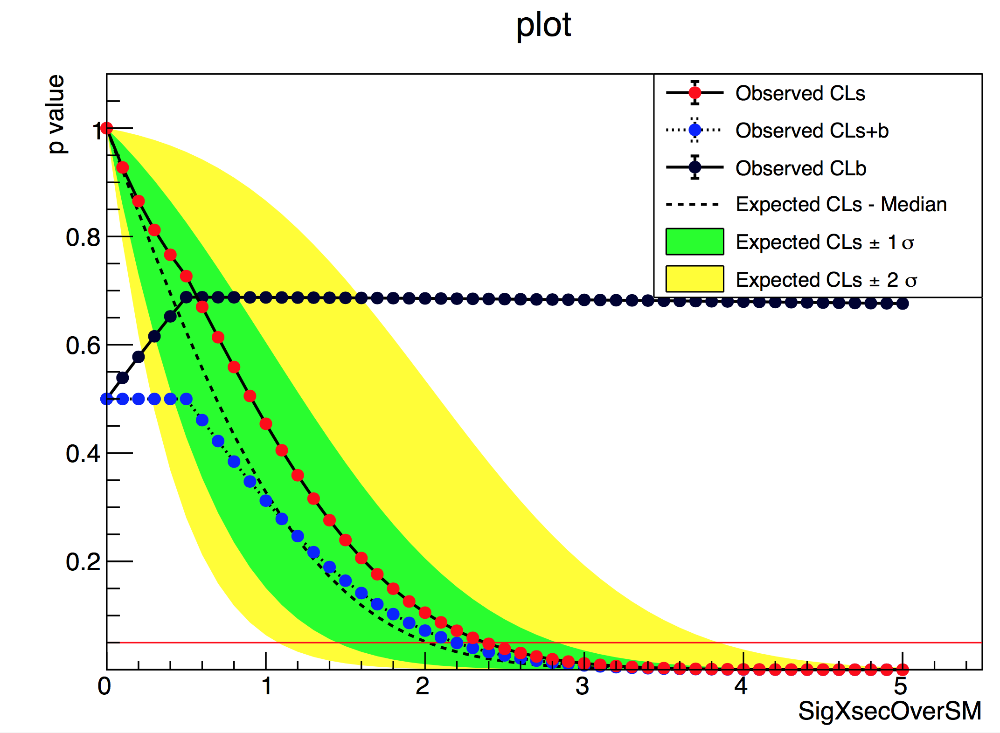
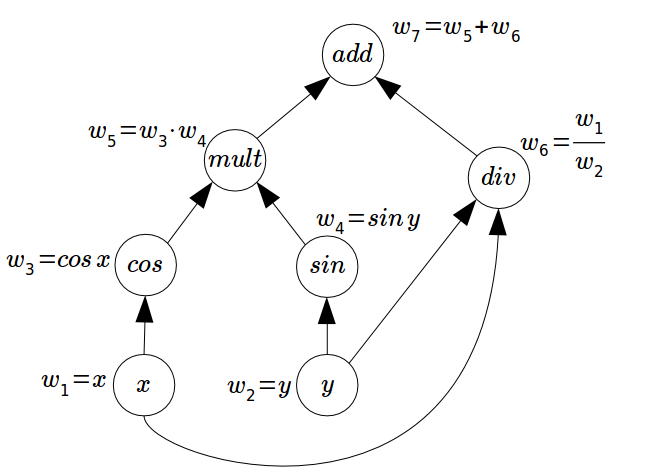

class: middle, center, title-slide
count: false

# `pyhf`: pure-Python
# implementation of HistFactory
# with autograd

Matthew Feickert<br>
[matthew.feickert@cern.ch](mailto:matthew.feickert@cern.ch)

[2018 US LHC Users Association Meeting Lightning Round](https://indico.fnal.gov/event/17566/other-view?view=standard)

October 26th, 2018

---

# Collaborators

<br><br>

<!-- .center[
.circle.width-30[] &nbsp;
.circle.width-30[] &nbsp;

] -->
.grid[
.kol-1-3.center[
<!-- .circle.width-80[] -->
.circle.width-80[]

[Lukas Heinrich](https://github.com/lukasheinrich)

NYU
]
.kol-1-3.center[
.circle.width-80[]

[Giordon Stark](https://github.com/kratsg)

UCSC SCIPP
]
.kol-1-3.center[
<!-- .circle.width-70[] -->
.circle.width-70[]

[Kyle Cranmer](http://theoryandpractice.org/)

NYU
]
]

---

# HistFactory

- A flexible p.d.f. template to build statistical models from binned distributions and data
<!-- - Developed by Cranmer, et al. [1] -->
- Developed by Cranmer, Lewis, Moneta, Shibata, and Verkerke [1]
- Widely used by the HEP community for standard model measurements and BSM searches
   <!-- - Show public summary plots and link to references that use HistFactory (multi b-jets for example) -->

.kol-1-1.center[
.width-100[]
]

---

# HistFactory Template

$$\begin{aligned}
&\mathcal{P}\left(n\_{c}, x\_{e}, a\_{p} \middle|\phi\_{p}, \alpha\_{p}, \gamma\_{b} \right) = \\\\
&{\color{blue}{\prod\_{c \\,\in\\, \textrm{channels}} \left[\textrm{Pois}\left(n\_{c} \middle| \nu\_{c}\right) \prod\_{e=1}^{n\_{c}} f\_{c}\left(x\_{e} \middle| \vec{\alpha}\right)\right]}} {\color{red}{G\left(L\_{0} \middle| \lambda, \Delta\_{L}\right) \prod\_{p\\, \in\\, \mathbb{S}+\Gamma} f\_{p}\left(a\_{p} \middle| \alpha\_{p}\right)}}
\end{aligned}$$

.bold[This is a _mathematical_ representation!] Nowhere is any software spec defined

Until now, the only implementation of HistFactory has been in RooStats+RooFit

- To start using HistFactory p.d.f.s first have to learn ROOT, RooFit, RooStats
   - Problem for our theory colleagues (generally don't want to)
- Possible issues with scaling I/O and memory for large models
   - Not multithreaded
<!-- - Difficult to interface with modern tools for minimization and computation of the p.d.f. -->
- Likelihood stored in the binary ROOT format
   - Challenge for long-term preservation (i.e. [HEPData](https://www.hepdata.net/))
   - Why is a histogram needed for an array of numbers?

---

# `pyhf`: HistFactory in pure Python

<br>
- First non-ROOT implementation of the HistFactory p.d.f. template
   - pure-Python library
      - [`pip install pyhf[tensorflow]`](https://diana-hep.org/pyhf/installation.html#with-tensorflow-backend)
- Alternative choice to ROOT-based HistFactory to use in the analysis pipeline of HistFitter + HistFactory + RooStats
   - Not a replacement for HistFitter or RooStats
- Open source tool for all of HEP
   - Originated from a [DIANA/HEP](https://diana-hep.org/) project fellowship
   - Dev team are on ATLAS and have contributions from [CMS members](https://github.com/diana-hep/pyhf/commit/4159c2dbc9ed7a9b3866e9b127d885d696314754) and [strong interest by theorists](https://indico.cern.ch/event/689514/contributions/2961925/)
   - Has _already been used for reinterpretation_ in phenomenology paper (now on arXiv) [2]

.center.width-90[[](https://arxiv.org/pdf/1810.05648.pdf#page=21)]

---

# HistFactory in ROOT Environment

.center.width-100[]

.footnote[[Image credit: Lukas Heinrich](https://indico.cern.ch/event/754255/contributions/3129528/)]

---

# HistFactory with `pyhf`

.center.width-100[]

.footnote[[Image credit: Lukas Heinrich](https://indico.cern.ch/event/754255/contributions/3129528/)]

---

# What does `pyhf` provide?

1\. .bold[Standalone pure-Python HistFactory implementation] including hooks into
modern deep-learning, autodifferentiable tensor libraries

- No ROOT dependency required at all!

2\. .bold[Pure JSON schema] to distribute and archive HistFactory models
ingredients without any reliance on binary formats

3\. .bold[Consistent results] with ROOT

.grid[
.kol-1-3.center[
<!-- .width-100[] -->
.width-100[]

ROOT
]
.kol-1-3.center[
<!-- .width-100[] -->
.width-100[]

pyhf
]
.kol-1-3.center[
.width-100[]

Same Result
]
]

<!-- --- -->
<!--  -->
<!-- class: middle

- .bold[a useful template for all of HEP]
   - easy to use alternative implementation for non-ROOT software stack
- .bold[open industry standard file formats]
   - JSON will be with us for a long long time
- .bold[hardware acceleration]
   - CPU → GPU with a simple switch
- .bold[machine learning framework backends]
   - Full gradients for minimization
- .bold[path to distributed, cluster-based computation]
   - Coming soon: [Dask](http://dask.pydata.org/en/latest/) backend
- .bold[easy reinterpretation]
- .bold[toy and asymptotic calculations]
   - In now: asymptotics
   - Coming soon: sampling (think [`tfp`](https://github.com/tensorflow/probability)) -->

---

<!-- # [Hello World, `pyhf` style](https://diana-hep.org/pyhf/examples/notebooks/hello-world.html) -->

# Easy to use Pythonic API

- Easy to use alternative implementation for non-ROOT software stack brings the useful HistFactory template to all of HEP

.bold[[Hello World, `pyhf` style](https://diana-hep.org/pyhf/examples/notebooks/hello-world.html):]

- Two bin counting experiment with a background uncertainty
<!--  -->
<!-- - <a href="https://carbon.now.sh/?bg=rgba(255%2C255%2C255%2C1)&t=seti&wt=none&l=python&ds=true&dsyoff=20px&dsblur=68px&wc=true&wa=true&pv=48px&ph=32px&ln=false&fm=Hack&fs=14px&lh=133%25&si=false&code=%253E%253E%253E%2520import%2520pyhf%250A%253E%253E%253E%2520import%2520pyhf.simplemodels%250A%253E%253E%253E%2520import%2520pyhf.utils%250A%253E%253E%253E%250A%253E%253E%253E%2520pdf%2520%253D%2520pyhf.simplemodels.hepdata_like(%250A...%2520%2520%2520%2520%2520signal_data%253D%255B12.0%252C%252011.0%255D%252C%2520bkg_data%253D%255B50.0%252C%252052.0%255D%252C%2520bkg_uncerts%253D%255B3.0%252C%25207.0%255D)%250A%253E%253E%253E%2520CLs_obs%252C%2520CLs_exp%2520%253D%2520pyhf.utils.hypotest(%250A...%2520%2520%2520%2520%25201.0%252C%2520%255B51%252C%252048%255D%2520%252B%2520pdf.config.auxdata%252C%2520pdf%252C%2520return_expected%253DTrue)%250A%253E%253E%253E%2520print(%27Observed%253A%2520%257B%257D%252C%2520Expected%253A%2520%257B%257D%27.format(CLs_obs%252C%2520CLs_exp))%250AObserved%253A%2520%255B0.05290116%255D%252C%2520Expected%253A%2520%255B0.06445521%255D%250A%250A&es=2x&wm=false&ts=false">Two bin counting experiment with a background uncertainty</a> -->

<!-- .center.width-100[] -->
.center.width-100[]

---

# Open industry standard file formats

<a href="https://carbon.now.sh/?bg=rgba(255%2C255%2C255%2C1)&t=seti&wt=none&l=application%2Fjson&ds=true&dsyoff=20px&dsblur=68px&wc=true&wa=true&pv=48px&ph=32px&ln=false&fm=Hack&fs=14px&lh=133%25&si=false&code=%257B%250A%2520%2520%2520%2520%2522channels%2522%253A%2520%255B%257B%250A%2520%2520%2520%2520%2520%2520%2520%2520%2522name%2522%253A%2520%2522singlechannel%2522%252C%250A%2520%2520%2520%2520%2520%2520%2520%2520%2522samples%2522%253A%2520%255B%257B%250A%2520%2520%2520%2520%2520%2520%2520%2520%2520%2520%2520%2520%2520%2520%2520%2520%2522name%2522%253A%2520%2522sig%2522%252C%250A%2520%2520%2520%2520%2520%2520%2520%2520%2520%2520%2520%2520%2520%2520%2520%2520%2522data%2522%253A%2520%255B12.0%252C%252011.0%255D%252C%250A%2520%2520%2520%2520%2520%2520%2520%2520%2520%2520%2520%2520%2520%2520%2520%2520%2522modifiers%2522%253A%2520%255B%257B%2520%2522name%2522%253A%2520%2522mu%2522%252C%2520%2522data%2522%253A%2520null%252C%2520%2522type%2522%253A%2520%2522normfactor%2522%2520%257D%255D%250A%2520%2520%2520%2520%2520%2520%2520%2520%2520%2520%2520%2520%257D%252C%250A%2520%2520%2520%2520%2520%2520%2520%2520%2520%2520%2520%2520%257B%250A%2520%2520%2520%2520%2520%2520%2520%2520%2520%2520%2520%2520%2520%2520%2520%2520%2522name%2522%253A%2520%2522bkg%2522%252C%250A%2520%2520%2520%2520%2520%2520%2520%2520%2520%2520%2520%2520%2520%2520%2520%2520%2522data%2522%253A%2520%255B50.0%252C%252052.0%255D%252C%250A%2520%2520%2520%2520%2520%2520%2520%2520%2520%2520%2520%2520%2520%2520%2520%2520%2522modifiers%2522%253A%2520%255B%257B%2520%2522name%2522%253A%2520%2522uncorr_bkguncrt%2522%252C%2520%2522data%2522%253A%2520%255B3.0%252C%25207.0%255D%252C%2520%2522type%2522%253A%2520%2522shapesys%2522%2520%257D%255D%250A%2520%2520%2520%2520%2520%2520%2520%2520%2520%2520%2520%2520%257D%250A%2520%2520%2520%2520%2520%2520%2520%2520%255D%250A%2520%2520%2520%2520%257D%255D%252C%250A%2520%2520%2520%2520%2522data%2522%253A%2520%257B%250A%2520%2520%2520%2520%2520%2520%2520%2520%2522singlechannel%2522%253A%2520%255B51.0%252C%252048.0%255D%250A%2520%2520%2520%2520%257D%252C%250A%2520%2520%2520%2520%2522toplvl%2522%253A%2520%257B%250A%2520%2520%2520%2520%2520%2520%2520%2520%2522measurements%2522%253A%2520%255B%257B%250A%2520%2520%2520%2520%2520%2520%2520%2520%2520%2520%2520%2520%2522config%2522%253A%2520%257B%2520%2522poi%2522%253A%2520%2522mu%2522%2520%257D%252C%250A%2520%2520%2520%2520%2520%2520%2520%2520%2520%2520%2520%2520%2522name%2522%253A%2520%2522singlechannel%2522%250A%2520%2520%2520%2520%2520%2520%2520%2520%257D%255D%250A%2520%2520%2520%2520%257D%250A%257D&es=2x&wm=false&ts=false">`JSON`</a> defining a single channel, two bin counting experiment with systematics
<!-- .center.width-100[] -->
.center.width-100[]

---
# Machine Learning Frameworks for Computational Backends

.grid[
.kol-2-3[

<br>
- All numerical operations implemented in .bold[tensor backends] through an API of $n$-dimensional array operations

- Using deep learning frameworks as computational backends allows for .bold[exploitation of auto differentiation (autograd) and GPU acceleration]

- As huge buy in from industry we benefit for free as these frameworks are .bold[continually improved] by professional software engineers

]
.kol-1-3.center[
<!-- .width-40[] -->
.width-40[]

<br>

<!-- .width-100[] -->
.width-100[]

<br>

<!-- .width-100[] -->
.width-100[]
]
]

---

<!-- class: middle -->
<!--  -->
<!-- .bold[Automatic differentiation ([autograd](http://www.columbia.edu/~ahd2125/post/2015/12/5/))] -->
# Automatic differentiation

With ML backends gain access to _exact (higher order) derivatives_ &mdash; accuracy is only limited by floating point precision

$$
\frac{\partial L}{\partial \mu}, \frac{\partial L}{\partial \theta_{i}}
$$

.grid[
.kol-1-2[

<br><br>
Gain this through the frameworks creating directed _computational directed acyclic graphs_ and then applying the chain rule (to the operations)
]
.kol-1-2[
.center.width-100[]
.center[Simple example graph]
]
]

.footnote[[Image credit: Alan Du](http://www.columbia.edu/~ahd2125/post/2015/12/5/)]

---
# _Preliminary_ Benchmarking

| $\~~$ Fit Benchmark         |        `pyhf`       | $\~~$ `C++` ROOT $\~~$ |
| :-------------------------- | :-----------------: | :--------------------: |
| (Old) Single Channel        |        Faster       |                        |
| (Old) Multichannel          |                     |         Faster         |
| (.bold[New]) Single Channel | Faster _(100X old)_ |                        |
| (.bold[New]) Multichannel   |        Faster       |                        |

.bold[GPU Acceleration]: First GPU and TPU results running on Google Colab show order of magnitude speedup for large models
.center.width-80[]
.center[Single channel fit with $n$ bins (uncorrelated nuisance parameters).]

---
# Open Development

<br>

.center.width-100[]

<!-- <br> -->

.grid[
.kol-1-2[

- Openly [developed on GitHub](https://github.com/diana-hep/pyhf)
- User base growing and looking to use in Run2 analysis papers!
- [Contributions welcome](https://github.com/diana-hep/pyhf/blob/master/CONTRIBUTING.md)!
   - Just a PR away 😉

]
.kol-1-2[
.width-100[]
]
]
<!-- Upcoming: -->
<!-- - Finish vectorization and GPU support -->
<!-- - Add a bridge that wraps the `pyhf` p.d.f. as a `RooAbsPdf` -->

---
# Summary

<br>

- Developed and continuing to improve the first non-ROOT implementation of the HistFactory p.d.f. template in pure Python
   <!-- -  -->
   - Simple but powerful Pythonic API
   - .bold[Large speedup] over ROOT coming from vectorization and deep learning framework computational backends
- Enabling fast and flexible analysis
   - Excited users wanting to use for LHC Run2 papers
- JSON specification ideal for preservation and reinterpretation
   - Fully describe model with single simple text based (versionable) file
   - Robust .bold[long long term support]
- Openly developed on GitHub

---

class: end-slide, center

Backup

---

# HistFactory Template

<br>

$$\begin{aligned}
&\mathcal{P}\left(n\_{c}, x\_{e}, a\_{p} \middle|\phi\_{p}, \alpha\_{p}, \gamma\_{b} \right) = \\\\
&{\color{blue}{\prod\_{c \\,\in\\, \textrm{channels}} \left[\textrm{Pois}\left(n\_{c} \middle| \nu\_{c}\right) \prod\_{e=1}^{n\_{c}} f\_{c}\left(x\_{e} \middle| \vec{\alpha}\right)\right]}} {\color{red}{G\left(L\_{0} \middle| \lambda, \Delta\_{L}\right) \prod\_{p\\, \in\\, \mathbb{S}+\Gamma} f\_{p}\left(a\_{p} \middle| \alpha\_{p}\right)}}
\end{aligned}$$

.bold[Use:] Multiple disjoint _channels_ (or regions) of binned distributions with multiple _samples_ contributing to each with additional (possibly shared) systematics between sample estimates

.bold[Main pieces:]

- .blue[Poisson p.d.f. for bins observed in all channels]
- .red[Constraint p.d.f. (+ data) for "auxiliary measurements"]
   - encoding systematic uncertainties (normalization, shape, etc)

---

class: middle

.center[Additionally allows for interactive visualization]

<br>

.center.width-100[<iframe width="560" height="315" src="https://www.youtube.com/embed/9egt9ZTm7T0" frameborder="0" allow="autoplay; encrypted-media" allowfullscreen></iframe>]

.footnote[Image credit: Lukas Heinrich]

---

# Enough talk...live demo time!

<br><br>

.center.bold[Just click the button!]<br><br><br>

.center.width-70[[](https://mybinder.org/v2/gh/diana-hep/pyhf/talk/AML-Workshop-2018?filepath=docs%2Fexamples%2Fnotebooks%2Ftalks%2FAML-and-Stats-Forum-Demo.ipynb)]

---

# $CL_{s}$ Example using `pyhf` CLI

<a href="https://carbon.now.sh/?bg=rgba(255%2C255%2C255%2C1)&t=seti&wt=none&l=application%2Fjson&ds=true&dsyoff=20px&dsblur=68px&wc=true&wa=true&pv=48px&ph=32px&ln=false&fm=Hack&fs=14px&lh=133%25&si=false&code=%257B%250A%2520%2520%2520%2520%2522channels%2522%253A%2520%255B%257B%250A%2520%2520%2520%2520%2520%2520%2520%2520%2522name%2522%253A%2520%2522singlechannel%2522%252C%250A%2520%2520%2520%2520%2520%2520%2520%2520%2522samples%2522%253A%2520%255B%257B%250A%2520%2520%2520%2520%2520%2520%2520%2520%2520%2520%2520%2520%2520%2520%2520%2520%2522name%2522%253A%2520%2522sig%2522%252C%250A%2520%2520%2520%2520%2520%2520%2520%2520%2520%2520%2520%2520%2520%2520%2520%2520%2522data%2522%253A%2520%255B12.0%252C%252011.0%255D%252C%250A%2520%2520%2520%2520%2520%2520%2520%2520%2520%2520%2520%2520%2520%2520%2520%2520%2522modifiers%2522%253A%2520%255B%257B%2520%2522name%2522%253A%2520%2522mu%2522%252C%2520%2522data%2522%253A%2520null%252C%2520%2522type%2522%253A%2520%2522normfactor%2522%2520%257D%255D%250A%2520%2520%2520%2520%2520%2520%2520%2520%2520%2520%2520%2520%257D%252C%250A%2520%2520%2520%2520%2520%2520%2520%2520%2520%2520%2520%2520%257B%250A%2520%2520%2520%2520%2520%2520%2520%2520%2520%2520%2520%2520%2520%2520%2520%2520%2522name%2522%253A%2520%2522bkg%2522%252C%250A%2520%2520%2520%2520%2520%2520%2520%2520%2520%2520%2520%2520%2520%2520%2520%2520%2522data%2522%253A%2520%255B50.0%252C%252052.0%255D%252C%250A%2520%2520%2520%2520%2520%2520%2520%2520%2520%2520%2520%2520%2520%2520%2520%2520%2522modifiers%2522%253A%2520%255B%257B%2520%2522name%2522%253A%2520%2522uncorr_bkguncrt%2522%252C%2520%2522data%2522%253A%2520%255B3.0%252C%25207.0%255D%252C%2520%2522type%2522%253A%2520%2522shapesys%2522%2520%257D%255D%250A%2520%2520%2520%2520%2520%2520%2520%2520%2520%2520%2520%2520%257D%250A%2520%2520%2520%2520%2520%2520%2520%2520%255D%250A%2520%2520%2520%2520%257D%255D%252C%250A%2520%2520%2520%2520%2522data%2522%253A%2520%257B%250A%2520%2520%2520%2520%2520%2520%2520%2520%2522singlechannel%2522%253A%2520%255B51.0%252C%252048.0%255D%250A%2520%2520%2520%2520%257D%252C%250A%2520%2520%2520%2520%2522toplvl%2522%253A%2520%257B%250A%2520%2520%2520%2520%2520%2520%2520%2520%2522measurements%2522%253A%2520%255B%257B%250A%2520%2520%2520%2520%2520%2520%2520%2520%2520%2520%2520%2520%2522config%2522%253A%2520%257B%2520%2522poi%2522%253A%2520%2522mu%2522%2520%257D%252C%250A%2520%2520%2520%2520%2520%2520%2520%2520%2520%2520%2520%2520%2522name%2522%253A%2520%2522singlechannel%2522%250A%2520%2520%2520%2520%2520%2520%2520%2520%257D%255D%250A%2520%2520%2520%2520%257D%250A%257D&es=2x&wm=false&ts=false">`JSON` defining a single channel, two bin counting experiment with systematics</a>

.center.width-100[]

---

# $CL_{s}$ Example using `pyhf` CLI

<br>

```
$ pyhf cls demo.json
{
    "CLs_exp": [
        0.002606408505279359,
        0.013820656047622592,
        0.0644552079856191,
        0.23526102499555396,
        0.573041803728844
    ],
    "CLs_obs": 0.05290116065118097
}
```

---

# $CL_{s}$ with Reinterpretation

.bold[Original]

```
$ pyhf cls demo.json | jq .CLs_obs
0.05290116065118097
```

.bold[Consider a new signal to test]

```json
# new_signal.json
[{
    "op": "replace",
    "path": "/channels/0/samples/0/data",
    "value": [5.0, 6.0]
}]
```

.bold[Apply the patch with the new signal to update the likelihood]: $L \to L'$
```
$ pyhf cls demo.json --patch new_signal.json | jq .CLs_obs
0.3401578753020146
```

---

# JSON for Statistical Models

- Long term support for non-binary format (think .bold[preservation])
   - [HEPData](https://www.hepdata.net/record/ins1634607) now based on [JSON schema](https://www.hepdata.net/record/ins1634607?format=json)
- Language agnostic
   - Reimplement likelihood in a new language more easily (c.f. `pyhf`)
   - JSON contains information to build the HistFactory likelihood
- Human and machine readable
- Offer auto-generation support from existing XML+ROOT configuration
```
$ pyhf xml2json /path/to/config.xml > hf.json
```
- Much smaller size for archiving
   - .bold[Realistic Example:] ATLAS multi b-jet analysis workspace

.grid[
.kol-1-2[

.blue[`pyhf` JSON schema]
```
744K mbj.json
 32K mbj.json.gz
```
]
.kol-1-2[
.red[ROOT]
```
260K config
7.5M data
1.5M results/workspace.root
```
]
]

---

# Realistic Example Use Case

<br>

.blue[CPU NumPy backend of `pyhf`] vs. .red[ROOT HistFactory] on ATLAS multi b-jet Analysis
  - multi b-jet `HistFitter` configuration has 23 Channels

<br>

```
$ time pyhf cls mbj.json | jq .CLs_obs
0.2614638795780821
```
.blue[`16.32s user 0.93s system 95% cpu 18.152 total`]

```
$ time root_cls.py atlas-conf-2018-041/workspace.root | jq .CLs_obs
0.25606989834647437
```
.red[`40.01s user 1.38s system 86% cpu 47.978 total`]

---
# _Preliminary_ Benchmarking

.grid[
.kol-1-2[

- Changing with many updates
- For a single channel with $n$ nuisance parameters already seeing performance boosts
- For many channels ROOT .bold[was] faster. With latest PRs `pyhf` now _faster_ than ROOT in all cases.
- Needs to be revisited with recent updates that properly .bold[implement vectorization] and graph structure
   - Seeing over a $100x$ speedup to that seen in image
- Still need to finish benchmarking on GPUs
   - Already see a $10x$ speedup

]
.kol-1-2[
.width-100[]

_old benchmark_: Single channel fit with $n$ bins (uncorrelated nuisance parameters) with CPU backends. Lower is better.
]
]

---
# Use in Reinterpretation

.center.width-90[[](https://inspirehep.net/record/1698425)]

.center.width-90[[](https://arxiv.org/pdf/1810.05648.pdf#page=21)]
.center.width-40[[](https://twitter.com/lukasheinrich_/status/1052142936803160065)]

---
# Will `pyhf` extend to unbinned models?

<br>

- The project scope is to implement HistFactory as best as possible. While implementing unbinned models is not an impossibility, it is not in the project goals at the current time.
- There are already projects like [GooFit](https://github.com/GooFit/GooFit), which nicely handle unbinned models.
   - [](https://zenodo.org/badge/latestdoi/9017446)
- While [contributions are welcome](https://github.com/diana-hep/pyhf/blob/master/CONTRIBUTING.md), it might be worth starting a different project or contributing to projects already focused on unbinned models.

---

# The JSON has both the modifiers and the data. Is this a good idea?

<br>

- The `pyhf` dev team views this as a good feature, not a bug.
- However, the `pyhf` dev team is considering using parts of [`histbook`](https://github.com/scikit-hep/histbook) in the future, leading to some separation.
   - [](https://doi.org/10.5281/zenodo.1321926)

---

# References

1. ROOT collaboration, K. Cranmer, G. Lewis, L. Moneta, A. Shibata and W. Verkerke, .italic[[HistFactory: A tool for creating statistical models for use with RooFit and RooStats](http://inspirehep.net/record/1236448)], 2012.
2. L. Heinrich, H. Schulz, J. Turner and Y. Zhou, .italic[[Constraining $A_{4}$ Leptonic Flavour Model Parameters at Colliders and Beyond](https://inspirehep.net/record/1698425)], 2018.

---

class: end-slide, center
count: false

The end.
